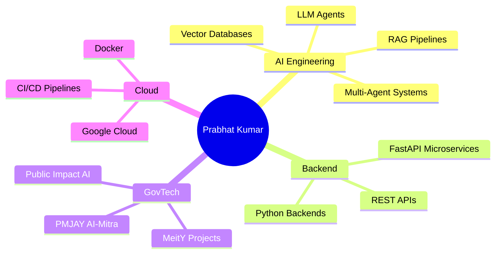

<div align="center">

<!-- Animated Header Banner -->


<!-- Typing SVG -->
<a href="https://git.io/typing-svg">
  
</a>

<br/>

<!-- Profile Views & Social Badges -->
<p>
  
  &nbsp;
  <a href="https://www.linkedin.com/in/prabhatkumarindia/">
    
  </a>
  &nbsp;
  <a href="https://x.com/hunter404_Pr">
    
  </a>
  &nbsp;
  <a href="https://g.dev/DevPrabhat">
    
  </a>
  &nbsp;
  <a href="https://www.hackerrank.com/profile/prabhat8065">
    
  </a>
</p>

</div>

---

## 🧠 About Me


```python
class PrabhatKumar:
    def __init__(self):
        self.name       = "Prabhat Kumar"
        self.role       = "AI Engineer & LLM Architect"
        self.org        = "Ministry of Electronics & IT (MeitY), India"
        self.location   = "New Delhi, India 🇮🇳"
        self.languages  = ["Python", "JavaScript", "SQL", "Bash"]
        self.focus      = [
            "Enterprise RAG Pipelines",
            "LLM Agent Orchestration",
            "FastAPI Microservices",
            "GovTech AI Solutions",
        ]
        self.motto      = "Ship AI that matters at scale. 🚀"

    def current_mission(self):
        return "Engineering AI for public impact — one pipeline at a time."
```

<br clear="right"/>

- 🏛️ **Currently:** AI Developer @ **Ministry of Electronics & IT (MeitY), Govt. of India**
- 🤖 **Specialization:** RAG Pipelines · LLM Agents · CrewAI · Ollama · FastAPI
- 🏥 **Flagship Project:** PMJAY AI-Mitra — AI chatbot for Ayushman Bharat scheme
- 🌐 **Portfolio:** [g.dev/DevPrabhat](https://g.dev/DevPrabhat)
- 📬 **Connect:** [linkedin.com/in/prabhatkumarindia](https://www.linkedin.com/in/prabhatkumarindia/)
- ⚡ **Fun Fact:** I build AI systems that serve millions of citizens!

---

## 🛠️ Tech Arsenal

<div align="center">

### 🤖 AI / ML / LLM Stack
<p>
  
  
  
  
  
  
  
  
</p>

### ⚡ Backend & APIs
<p>
  
  
  
  
</p>

### 🗄️ Databases & Vector Stores
<p>
  
  
  
  
  
</p>

### ☁️ Cloud & DevOps
<p>
  
  
  
  
</p>

### 🎨 Frontend & Data
<p>
  
  
  
  
  
  
  
</p>

</div>

---

## 📊 GitHub Stats Dashboard

<div align="center">

<table>
<tr>
<td width="50%">


</td>
<td width="50%">


</td>
</tr>
</table>


</div>

---

## 🏆 Achievements & Trophies

<div align="center">


</div>

---

## 🚀 Featured Projects

<div align="center">

<table>
<tr>
<td width="50%" valign="top">

### 🏥 PMJAY AI-Mitra
<a href="https://github.com/prabhatKumar65/PMJAY-Chatbot-POC">
  
</a>

> 🤖 AI chatbot for Ayushman Bharat scheme with real-time eligibility verification, hospital search & Ollama Mistral integration

</td>
<td width="50%" valign="top">

### 📄 RFP Analyzer (CrewAI)
<a href="https://github.com/prabhatKumar65/rfp-analyzer-crewai">
  
</a>

> 🧠 Multi-agent AI workflow using CrewAI + local Ollama (Mistral) for intelligent RFP document analysis

</td>
</tr>
<tr>
<td width="50%" valign="top">

### 🌐 AI Engineer Portfolio
<a href="https://github.com/prabhatKumar65/prabhat-portfolio-website">
  
</a>

> 💼 Production-ready AI Engineer portfolio showcasing RAG chatbot, AI/ML projects & backend experience

</td>
<td width="50%" valign="top">

### 📊 Data Science Graph Program
<a href="https://github.com/prabhatKumar65/Data-Science-Graph-Programe-">
  
</a>

> 📈 Data visualization with Matplotlib, NumPy & Pandas: Histograms, Bar charts, Scatter plots & Pie charts

</td>
</tr>
</table>

</div>

---

## 📈 Contribution Activity

<div align="center">


</div>

---

## 🎓 Certifications & Cloud Badges

<div align="center">

<a href="https://www.cloudskillsboost.google/public_profiles/3ff73590-e1a6-4a1b-b9c0-377bca1e73c4">
  
</a>
&nbsp;
<a href="https://www.hackerrank.com/profile/prabhat8065">
  
</a>
&nbsp;


</div>

---

## 💡 What I'm Working On



---

## 🤝 Let's Connect & Collaborate

<div align="center">

<a href="https://www.linkedin.com/in/prabhatkumarindia/">
  
</a>
&nbsp;
<a href="mailto:prabhat8065@gmail.com">
  
</a>
&nbsp;
<a href="https://g.dev/DevPrabhat">
  
</a>

<br/><br/>

> 💬 *"I'm always open to discussing AI projects, GovTech innovation, RAG architectures, or exciting collaboration opportunities!"*

</div>

---

## 📊 Weekly Dev Breakdown

<!--START_SECTION:waka-->
```text
Python       ████████████████████░░░░   78.5 %
JavaScript   ████░░░░░░░░░░░░░░░░░░░░   12.3 %
SQL          ██░░░░░░░░░░░░░░░░░░░░░░    5.7 %
Bash         █░░░░░░░░░░░░░░░░░░░░░░░    2.4 %
YAML         ░░░░░░░░░░░░░░░░░░░░░░░░    1.1 %
```
<!--END_SECTION:waka-->

---

<div align="center">

### 💖 Support My Work

<a href="https://github.com/prabhatKumar65">
  
</a>
&nbsp;
<a href="https://github.com/prabhatKumar65?tab=followers">
  
</a>

<br/><br/>


</div>
